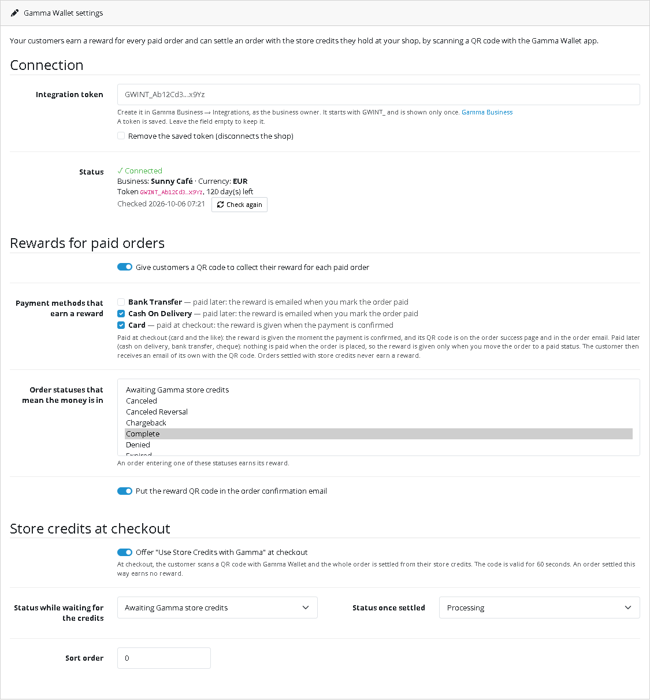
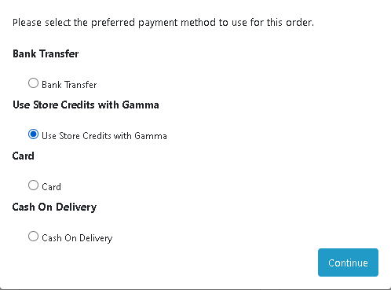
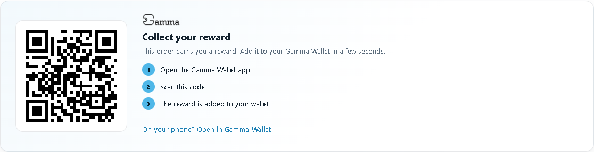
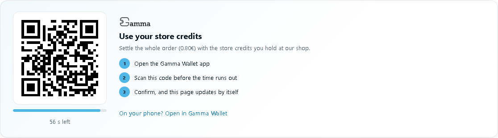
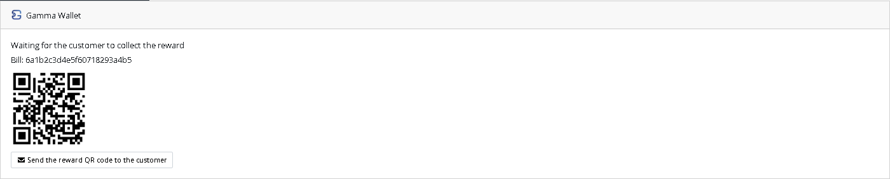

# Gamma Wallet for OpenCart

Use [Gamma Wallet](https://www.gamma-wallet.com) in your OpenCart shop. Once the extension is installed:

- **Your customers earn a reward for every paid order.** After paying, they scan a QR code with the Gamma Wallet app and the reward is added to their wallet, under your business.
- **Your customers can use the store credits they hold at your shop.** At checkout they choose *Use Store Credits with Gamma*, scan a QR code, and the whole order is settled from their credits.

Credits are a promise of value at your business. They are not money and not crypto, and Gamma never handles any payment. Card payments, cash on delivery and the rest keep working exactly as they do today.

This guide is for shop owners. No coding is needed. If you want to connect your own software instead of OpenCart, see [byCode](https://github.com/Gamma-Wallet/Integrations-samples-/tree/main/byCode).

---

## Contents

1. [What you need](#1-what-you-need)
2. [Install the extension](#2-install-the-extension)
3. [Create your integration token in Gamma Business](#3-create-your-integration-token-in-gamma-business)
4. [Connect your shop](#4-connect-your-shop)
5. [Choose which orders earn a reward](#5-choose-which-orders-earn-a-reward)
6. [Store credits at checkout](#6-store-credits-at-checkout)
7. [What your customers see](#7-what-your-customers-see)
8. [Your orders](#8-your-orders)
9. [Renewing your token](#9-renewing-your-token)
10. [Questions and answers](#10-questions-and-answers)
11. [When something is wrong](#11-when-something-is-wrong)

---

## 1. What you need

| | |
|---|---|
| A Gamma Business account with a **Reward** service active | [Register](https://business.gamma-wallet.com) and start on the free tier, then activate a Reward service. The extension works only with a Reward service: while another kind of service is active (a membership or a discount card, for example), customers get no reward QR code and store credits are not offered at checkout. |
| OpenCart | Version **4.0.2.0 or newer** (tested with 4.1.0.4 and its default theme). OpenCart 3 and the first 4.0 releases (4.0.0.0 to 4.0.1.x) work differently and are not supported. |
| The same currency | Your shop must sell in the same currency as your Gamma business (for example EUR in both). |
| Email | Your shop must be able to send email (*System → Settings → your store → Mail*), so customers receive their reward. |

## 2. Install the extension

1. Download **[gamma_wallet.ocmod.zip](gamma_wallet.ocmod.zip)** (on GitHub, open the file and click *Download raw file*). Keep the file name as it is.
2. In your OpenCart admin, go to **Extensions → Installer**, click **Upload** and choose the file.
3. In the list below, click the green **Install** button next to *Gamma Wallet*.
4. Go to **Extensions → Extensions**, choose **Payments** in the filter, and click the green **+** next to *Gamma Wallet*.
5. Click the blue **pencil** next to *Gamma Wallet* to open its settings.

Only orders placed **after** the extension is installed earn rewards; older orders never do.

**Updating to a new version:** upload the new zip in **Extensions → Installer** and install it, then in **Extensions → Extensions → Payments** uninstall and install *Gamma Wallet* again so its new parts are registered, and paste your integration token once more. Reinstalling never gives an order a second reward.

## 3. Create your integration token in Gamma Business

The token is the key that lets your shop talk to your Gamma business. You never give the extension your password.

1. Sign in to [Gamma Business](https://business.gamma-wallet.com) as the business owner.
2. Open **Integrations**.
3. Click **Create token** and choose how long it stays valid (up to one year).
4. **Copy the token now.** It starts with `GWINT_` and is shown only once.

Keep the token private, like a password. Anyone who has it can create rewards for your business. If you think it has leaked, disable it in **Integrations** and create a new one.

## 4. Connect your shop

1. Open the Gamma Wallet settings (**Extensions → Extensions → Payments**, pencil next to *Gamma Wallet*).
2. Paste the token into **Integration token**.
3. Click the blue **Save** button at the top.

Under **Status** you should now see **✓ Connected**, your business name, your currency and how many days the token has left. If a red line says your business has no Reward service active, activate one in Gamma Business, then click **Check again**.

The token field stays empty after saving; that is on purpose, so the token can't be read back from the page. Only its first and last characters are shown. To change it, paste a new one. To disconnect the shop, tick **Remove the saved token**.

## 5. Choose which orders earn a reward

Under **Rewards for paid orders**:

- **Give customers a QR code…**: turns rewards on or off for the whole shop.
- **Payment methods that earn a reward**: one tick box for each payment method your shop has.
- **Order statuses that mean the money is in**: an order entering one of these statuses earns its reward. By default *Processing*, *Shipped*, *Processed* and *Complete*.
- **Put the reward QR code in the order confirmation email**.

The rule is simple: **a reward is given only for money you have actually received.**

| Payment method | When the reward is given | Where the customer finds the QR code |
|---|---|---|
| Paid at checkout (card, PayPal and the like) | As soon as the payment is confirmed (the order reaches one of the statuses above) | On the order success page and in the order confirmation email |
| Paid later: cash on delivery, bank transfer, cheque | Only when **you** move the order to one of those statuses, meaning you have received the money | In an email of its own, sent once at that moment |
| Store credits (*Use Store Credits with Gamma*) | Never: the customer used their credits rather than paying | — |

Online payment methods are ticked by default. Cash on delivery, bank transfer and cheque are not; tick them if you want those orders to earn a reward once they are paid.

The reward the customer receives follows the Reward service you have active in Gamma Business. You don't set amounts in OpenCart.

## 6. Store credits at checkout

*Use Store Credits with Gamma* is turned on when the extension is installed. You can turn it off under **Store credits at checkout** in the settings. Customers see it among the payment methods:

The same section has two statuses:

- **Status while waiting for the credits**: *Awaiting Gamma store credits*, which the extension adds to your shop.
- **Status once settled**: *Processing* by default.

Good to know:

- Store credits always cover the **whole** order. A customer who doesn't hold enough credits at your shop can't complete it with their credits and chooses another payment method instead.
- The option is shown only when your shop is connected, your business has a Reward service active, the currency matches and the order total is above zero.
- An order settled with store credits doesn't earn a new reward.
- If the customer confirms in the app and closes the page straight away, the order is still settled: the extension checks waiting orders with Gamma while customers browse your shop (every 2 minutes at most), and OpenCart's hourly cron job (**System → Maintenance → Cron Jobs**) does it too.
- If an order is paid with credits after it was cancelled, its status is not changed: a note in its history tells you, because the customer has used their credits.

## 7. What your customers see

### An order paid at checkout

The order success page shows the reward. The customer opens the Gamma Wallet app, scans the code, and the reward is added to their wallet. The same code is in their order confirmation email, so they can scan it later from another device.

On a phone, *Open in Gamma Wallet* opens the same reward without scanning.

### An order paid on delivery or by bank transfer

At checkout and in the order emails there is no reward yet, because nothing has been paid; the success page says that a QR code will follow by email. When the money is in, you move the order to *Processing* (or another paid status) and the customer receives the email *Your reward from (your shop) (order …)* with the QR code.

### An order settled with store credits

After placing the order, the customer sees a QR code with a countdown. They scan it with the Gamma Wallet app and confirm. The page updates by itself and the order moves to *Processing*, with a note in its history.

Each code is valid for **60 seconds**. If time runs out, the customer gets a button to show a new code. Until the customer confirms, the order stays *Awaiting Gamma store credits*.

### Guests

Customers don't need an account in your shop. The reward QR code is on the success page and in the email that goes to the address they gave at checkout. They only need the free Gamma Wallet app.

## 8. Your orders

Every order has a **Gamma Wallet** box on its page in **Sales → Orders**, above the history. It tells you where things stand:

- *Waiting for the customer to collect the reward*, with the QR code (you can show it to a customer standing in front of you)
- *Reward collected*
- *Paid later: when you move the order to a paid status, the reward QR code is created…*
- *Waiting for the customer to settle it with store credits*
- an error message, if the reward could not be created (see [section 11](#11-when-something-is-wrong))

**Sending the reward again.** If a customer lost the email, click **Send the reward QR code to the customer** in the box. Each order has exactly one reward, and it can be collected only once; sending it again doesn't create a second reward.

## 9. Renewing your token

Every token has an end date. The settings page shows how many days yours has left, so look at it now and then.

To renew:

1. In Gamma Business → **Integrations**, click **Replace token** and copy the new one.
2. Paste it in the Gamma Wallet settings and click **Save**.

Do both steps together. **The old token stops working the moment you create the new one**, and you can create one token every 24 hours.

## 10. Questions and answers

**Does Gamma take a share of my sales or touch the payment?**
No. Customers pay you exactly as before, through the payment methods you already use. Gamma only records the reward contract for the order. A customer who uses store credits is using value you promised earlier, not paying Gamma.

**What does the extension send to Gamma?**
Every request carries your integration token and the extension version. For each order that earns a reward or uses store credits: an order reference (such as *OC-3f9a1c-42*: your order number with a short tag for your shop), the total, the currency, the order date, and the name of the platform (OpenCart). About once an hour it checks the connection. No names, addresses, email addresses or products.

The reward QR code image on the order pages, in the emails and on the admin order page is loaded from `integration.gamma-wallet.com`, so the customer's browser or email app contacts that server when it shows it. Mention this in your shop's privacy policy.

**I use an anti-fraud extension.**
Then the reward waits for the status the order really gets after the fraud check, and arrives by email. An order the check holds back earns nothing until you move it to a paid status yourself.

**A card payment is confirmed a while after the order (the order starts as *Pending*).**
The reward is created when the payment is confirmed and sent by email, because the order email has already gone out by then.

**My customer doesn't have the Gamma Wallet app yet.**
They install the free Gamma Wallet app, sign up, and scan the code from the success page or the email.

**Can a customer collect the same reward twice, or collect someone else's?**
No. Each order's reward can be collected once, by the first person who scans it. Customers should treat the code like a voucher.

**An order is refunded or cancelled. What happens to the reward?**
The extension doesn't take a reward back. If the order already had a reward, its QR code still works until the customer collects it, and a collected reward stays in their wallet. For cash on delivery and bank transfer, you avoid this by moving an order to a paid status only once you have the money.

**What happens if I uninstall the extension?**
New rewards stop and the store credits option disappears. Rewards already given stay in your customers' wallets. Uninstalling also removes its settings, including the saved token, its cron job and the Gamma details it kept for each order. The status *Awaiting Gamma store credits* stays, because past orders use it, and so does a short installation code, so that reinstalling never gives an order a second reward.

## 11. When something is wrong

| What you see | What to do |
|---|---|
| **Status** says the token is not valid, expired or disabled | Create a new token in Gamma Business → Integrations and paste it in. |
| *… works only with a Reward service* | Your active service in Gamma is not a Reward service. Activate a Reward service in Gamma Business. The extension checks again every hour; click **Check again** to see the change at once. |
| *Your shop sells in … but your Gamma business uses …* | Your shop's default currency (*System → Settings → your store → Local*) must be the same as your Gamma business currency. |
| *Use Store Credits with Gamma* is missing at checkout | Check that it is turned on in the settings, that **Status** shows *Connected* with no red line about the Reward service, that the currencies match and that the total is above zero. |
| An order has no reward | Check that your business has a Reward service active, that the payment method is ticked, that **Rewards** is on, that the order is in one of the paid statuses, and that it was placed after the extension was installed. The order's Gamma Wallet box gives the reason. |
| An error in the order's Gamma Wallet box | Fix the cause it names (usually the token), then click **Send the reward QR code to the customer**: this creates the reward and emails it, also after the automatic tries have run out. |
| An order paid with store credits still waits | It is settled as soon as someone browses your shop or the hourly cron job runs. Check that OpenCart's cron runs (**System → Maintenance → Cron Jobs**). |
| *Gamma could not be reached* | Your hosting must allow outgoing connections to `https://integration.gamma-wallet.com`. Ask your hosting provider if this message stays. |
| *Too many requests to Gamma* | Wait a minute and try again. |
| The reward email didn't arrive | Ask the customer to check their spam folder, then send it again from the order. If none of your shop's emails arrive, the problem is your shop's mail settings, not the extension. |

The extension writes its problems to **System → Maintenance → Error Logs**, with lines starting `Gamma Wallet:`, which you can share with support.

Still stuck? Contact us through [gamma-wallet.com](https://www.gamma-wallet.com).

---

The extension's source code is in [gamma_wallet](gamma_wallet). It is released under the GPL-3.0-or-later licence, like OpenCart itself.
